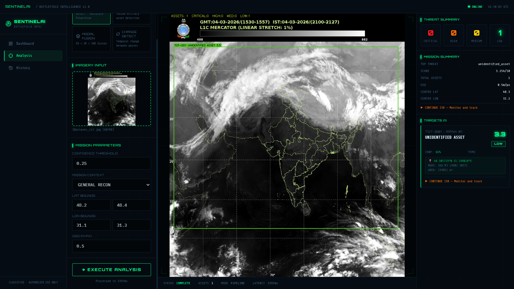

<div align="center">

# 🛡️ SentinelAI
### AI Battlefield Intelligence Platform


**Real-time military asset detection · geolocation · threat prioritization from satellite and drone imagery**

[🚀 Quick Start](#quick-start) · [📡 API Docs](#api-reference) · [🧠 How It Works](#how-it-works)

---



</div>

---

## 🎯 What It Does

SentinelAI is a full-stack AI platform that processes satellite and drone imagery through a complete battlefield intelligence pipeline:

1. **Detects** military assets using YOLOv8 — tanks, radar arrays, aircraft, missile launchers, ships, command vehicles
2. **Fuses** EO + IR + SAR sensor modalities using channel-attention weighted fusion + CLAHE enhancement
3. **Geolocates** every detection — pixel coordinates → WGS84 lat/lon + MGRS grid reference
4. **Prioritizes** targets using multi-factor threat scoring: `base × confidence × proximity × operator × mission`
5. **Detects changes** between satellite passes using CLIP ViT-B/32 semantic similarity + pixel-level difference maps

---

## 🧠 How It Works

| Component | Technology | Purpose |
|-----------|-----------|---------|
| Object Detection | **YOLOv8n** (Ultralytics) | Military asset detection in aerial imagery |
| Change Detection | **CLIP ViT-B/32** (OpenAI) | Semantic scene change between satellite passes |
| Modal Fusion | **Channel-Attention + CLAHE** | EO + IR + SAR sensor fusion |
| Threat Scoring | **Multi-Factor Engine** | base × confidence × proximity × mission weights |
| Geospatial | **WGS84 + MGRS** | Pixel → GPS coordinate conversion |

### Threat Scoring Formula
```
FinalScore = BaseScore × ConfidenceWeight × ProximityWeight × OperatorWeight × MissionWeight
```
- **ConfidenceWeight**: `0.60 + 0.40 × conf^1.5` — high-confidence detections count more
- **ProximityWeight**: +4% bonus per nearby high-value asset within 0.8km
- **MissionWeight**: context multipliers (SEAD boosts radar 1.5×, anti-armor boosts tanks 1.4×)

---

## 🏗️ Architecture

```
┌─────────────────────────────────────────────────────────┐
│                 FRONTEND  (React 18)                     │
│   Vite · TypeScript · Tailwind · Zustand · TanStack      │
│   Tactical HUD UI · Drag-drop imagery · Live intel feed  │
└────────────────────────┬────────────────────────────────┘
                         │ REST API
┌────────────────────────▼────────────────────────────────┐
│                  BACKEND  (FastAPI)                      │
│                                                          │
│  ┌──────────┐  ┌──────────┐  ┌──────────┐  ┌────────┐  │
│  │  Detect  │  │   Fuse   │  │  Change  │  │  Geo   │  │
│  │ YOLOv8   │  │EO+IR+SAR │  │CLIP ViT  │  │WGS84   │  │
│  └──────────┘  └──────────┘  └──────────┘  └────────┘  │
│                                                          │
│       ┌─────────────────────────────────────┐           │
│       │     Threat Prioritization Engine     │           │
│       │  Score = Base×Conf×Proximity×Mission │           │
│       └─────────────────────────────────────┘           │
└─────────────────────────────────────────────────────────┘
```

---

## 🚀 Quick Start

### Prerequisites
- Python 3.11+
- Node.js 20+

### Run Locally

**Terminal 1 — Backend:**
```bash
cd backend
pip install fastapi uvicorn python-multipart pydantic pydantic-settings loguru
pip install torch torchvision --index-url https://download.pytorch.org/whl/cpu
pip install ultralytics transformers
python -m uvicorn app.main:app --reload --port 8000
```

Wait for: `✅  All systems ready`

**Terminal 2 — Frontend:**
```bash
cd frontend
npm install
npm run dev
```

Open: **http://localhost:5173**

---

## 📡 API Reference

| Method | Endpoint | Description |
|--------|----------|-------------|
| `POST` | `/api/v1/detect` | YOLOv8 military asset detection |
| `POST` | `/api/v1/fuse` | EO + IR + SAR modal fusion |
| `POST` | `/api/v1/change` | Temporal change detection |
| `POST` | `/api/v1/geolocate` | Pixel → GPS + MGRS coordinates |
| `POST` | `/api/v1/prioritize` | Multi-factor threat prioritization |
| `POST` | `/api/v1/pipeline` | Full end-to-end intelligence pipeline |
| `GET`  | `/health` | System status + loaded models |
| `GET`  | `/docs` | Interactive Swagger UI |

### Example Request
```bash
curl -X POST http://localhost:8000/api/v1/detect \
  -F "file=@image.jpg" \
  -F "confidence=0.25" \
  -F "mission=sead"
```

### Example Response
```json
{
  "assets": [
    {
      "asset_id": "TGT-001",
      "military_class": "radar_array",
      "confidence": 0.87,
      "threat_score": 9.2,
      "threat_level": "critical",
      "bbox": { "x1": 120, "y1": 85, "x2": 340, "y2": 210 }
    }
  ],
  "total": 3,
  "threat_counts": { "critical": 1, "high": 1, "medium": 1, "low": 0 },
  "latency_ms": 142.3
}
```

---

## 📁 Project Structure

```
sentinelai/
├── backend/
│   ├── app/
│   │   ├── core/
│   │   │   ├── config.py       # Settings + military asset taxonomy
│   │   │   ├── imaging.py      # Image processing utilities
│   │   │   └── registry.py     # ML model lifecycle manager
│   │   ├── services/
│   │   │   ├── detector.py     # YOLOv8 + military taxonomy mapping
│   │   │   ├── fusion.py       # EO+IR+SAR channel-attention fusion
│   │   │   ├── change.py       # CLIP ViT-B/32 change detection
│   │   │   ├── geospatial.py   # Pixel → WGS84 + MGRS
│   │   │   └── threat.py       # Multi-factor threat prioritization
│   │   └── api/v1/routes/      # REST endpoints
│   └── tests/                  # 30+ unit tests
├── frontend/
│   └── src/
│       ├── pages/              # Dashboard, Analysis, History
│       ├── components/         # Tactical HUD components
│       └── store/              # Zustand state management
├── infrastructure/
│   ├── terraform/              # AWS ECS + RDS + ALB
│   └── scripts/                # GCP + AWS deploy scripts
└── docker-compose.yml
```

---

## 🧪 Tests

```bash
cd backend
pytest tests/ -v --tb=short
```

30+ unit tests covering detection scoring, modal fusion, geospatial transforms, threat engine, and change detection.

---

## 🔧 Roadmap

- [ ] Fine-tune YOLOv8 on DOTA v1.5 dataset for true aerial OBB detection
- [ ] Replace pixel fusion with CMX cross-modal transformer
- [ ] Train change detection on LEVIR-CD / S2Looking datasets
- [ ] Add GeoTIFF GDAL affine transforms for real satellite coordinates
- [ ] GPU inference support via CUDA

---

<div align="center">

**Built with PyTorch · FastAPI · React 18 · YOLOv8 · CLIP ViT-B/32 · OpenCV · TypeScript**

</div>
