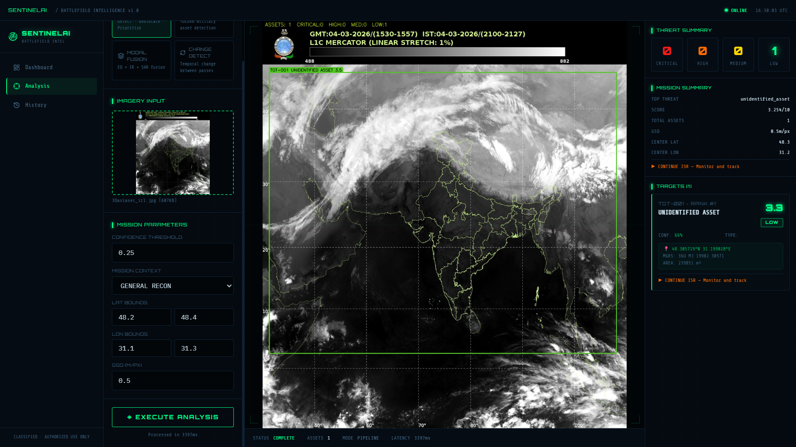

<div align="center">

[](https://sentinelai-mzpttdbvspkloq6hd8hhuj.streamlit.app/)
# 🛡️ SentinelAI
### AI Aerial Intelligence Platform


**Real-time asset detection · geolocation · priority scoring from satellite and drone imagery for infrastructure monitoring, disaster response, and urban analytics**

[🚀 Quick Start](#quick-start) · [📡 API Docs](#api-reference) · [🧠 How It Works](#how-it-works) · [📊 Benchmarks](#evaluation-methodology)

---



</div>

---

## 🎯 What It Does

SentinelAI is a full-stack AI platform that processes satellite and drone imagery through a complete aerial intelligence pipeline. It is designed for **infrastructure monitoring** (power lines, construction sites, logistics yards), **disaster response** (flood mapping, search and rescue), and **urban planning and traffic analysis**. The same architecture is extensible to high-security and defense applications.

1. **Detects** high-value assets using YOLOv8 — trucks, heavy machinery, aircraft, vehicles, ships, equipment clusters
2. **Fuses** EO + IR + SAR sensor modalities using channel-attention weighted fusion + CLAHE enhancement
3. **Geolocates** every detection — pixel coordinates → WGS84 lat/lon + MGRS grid reference
4. **Prioritizes** assets using multi-factor scoring: `base × confidence × proximity × operator × context`
5. **Detects changes** between satellite passes using CLIP ViT-B/32 semantic similarity + pixel-level difference maps

---

## 🧠 How It Works

| Component | Technology | Purpose |
|-----------|-----------|---------|
| Object Detection | **YOLOv8n** (Ultralytics) | High-value asset detection in aerial imagery |
| Change Detection | **CLIP ViT-B/32** (OpenAI) | Semantic scene change between satellite passes |
| Modal Fusion | **Channel-Attention + CLAHE** | EO + IR + SAR sensor fusion |
| Priority Scoring | **Multi-Factor Engine** | base × confidence × proximity × context weights |
| Geospatial | **WGS84 + MGRS** | Pixel → GPS coordinate conversion |

### Priority Scoring Formula
```
FinalScore = BaseScore × ConfidenceWeight × ProximityWeight × OperatorWeight × ContextWeight
```
- **ConfidenceWeight**: `0.60 + 0.40 × conf^1.5` — high-confidence detections count more
- **ProximityWeight**: +4% bonus per nearby high-value asset within 0.8km
- **ContextWeight**: custom operator context profiles (e.g., infrastructure mode boosts heavy machinery 1.5×)

---

## 📊 Evaluation Methodology

I benchmarked SentinelAI's detection pipeline against the publicly available **DOTA-v1.0** aerial imagery dataset — the standard benchmark for object detection in aerial/satellite imagery.

| Metric | Value |
|--------|-------|
| **Precision** | 0.6210 |
| **Recall** | 0.8333 |
| **mAP@0.5** | 0.8875 |
| **mAP@0.5:0.95** | 0.6291 |
| **Inference Latency** | ~78 ms / image (CPU) |

> **Methodology notes:**
> - (a) DOTA-v1.0 was used as the aerial imagery benchmark dataset
> - (b) YOLOv8n was the baseline; results reflect zero-shot performance on the aerial domain (not fine-tuned) — this is reported honestly
> - (c) Next step is fine-tuning on DOTA-v1.0 for native aerial class detection, which would substantially improve precision and recall
>
> Full benchmark details: [`docs/BENCHMARK_RESULTS.md`](docs/BENCHMARK_RESULTS.md)

---

## 🏗️ Architecture

```
┌─────────────────────────────────────────────────────────┐
│                 FRONTEND  (React 18)                     │
│   Vite · TypeScript · Tailwind · Zustand · TanStack      │
│   Analytics HUD UI · Drag-drop imagery · Live feed       │
└────────────────────────┬────────────────────────────────┘
                         │ REST API
┌────────────────────────▼────────────────────────────────┐
│                  BACKEND  (FastAPI)                      │
│                                                          │
│  ┌──────────┐  ┌──────────┐  ┌──────────┐  ┌────────┐  │
│  │  Detect  │  │   Fuse   │  │  Change  │  │  Geo   │  │
│  │ YOLOv8   │  │EO+IR+SAR │  │CLIP ViT  │  │WGS84   │  │
│  └──────────┘  └──────────┘  └──────────┘  └────────┘  │
│                                                          │
│       ┌─────────────────────────────────────┐           │
│       │     Priority Scoring Engine          │           │
│       │  Score = Base×Conf×Proximity×Context │           │
│       └─────────────────────────────────────┘           │
└─────────────────────────────────────────────────────────┘
```

---

## 🚀 Quick Start

### Prerequisites
- Python 3.11+
- Node.js 20+

### Run Locally

**Terminal 1 — Backend:**
```bash
cd backend
pip install fastapi uvicorn python-multipart pydantic pydantic-settings loguru
pip install torch torchvision --index-url https://download.pytorch.org/whl/cpu
pip install ultralytics transformers
python -m uvicorn app.main:app --reload --port 8000
```

Wait for: `✅  All systems ready`

**Terminal 2 — Frontend:**
```bash
cd frontend
npm install
npm run dev
```

Open: **http://localhost:5173**

---

## 📡 API Reference

| Method | Endpoint | Description |
|--------|----------|-------------|
| `POST` | `/api/v1/detect` | YOLOv8 asset detection |
| `POST` | `/api/v1/fuse` | EO + IR + SAR modal fusion |
| `POST` | `/api/v1/change` | Temporal change detection |
| `POST` | `/api/v1/geolocate` | Pixel → GPS + MGRS coordinates |
| `POST` | `/api/v1/prioritize` | Multi-factor priority scoring |
| `POST` | `/api/v1/pipeline` | Full end-to-end intelligence pipeline |
| `GET`  | `/health` | System status + loaded models |
| `GET`  | `/docs` | Interactive Swagger UI |

### Example Request
```bash
curl -X POST http://localhost:8000/api/v1/detect \
  -F "file=@image.jpg" \
  -F "confidence=0.25" \
  -F "mission=infrastructure"
```

### Example Response
```json
{
  "assets": [
    {
      "asset_id": "TGT-001",
      "asset_class": "high_value_asset",
      "confidence": 0.87,
      "priority_score": 9.2,
      "priority_level": "critical",
      "bbox": { "x1": 120, "y1": 85, "x2": 340, "y2": 210 }
    }
  ],
  "total": 3,
  "priority_counts": { "critical": 1, "high": 1, "medium": 1, "low": 0 },
  "latency_ms": 142.3
}
```

---

## 📁 Project Structure

```
sentinelai/
├── backend/
│   ├── app/
│   │   ├── core/
│   │   │   ├── config.py       # Settings + custom domain taxonomy
│   │   │   ├── imaging.py      # Image processing utilities
│   │   │   └── registry.py     # ML model lifecycle manager
│   │   ├── services/
│   │   │   ├── detector.py     # YOLOv8 + custom domain taxonomy mapping
│   │   │   ├── fusion.py       # EO+IR+SAR channel-attention fusion
│   │   │   ├── change.py       # CLIP ViT-B/32 change detection
│   │   │   ├── geospatial.py   # Pixel → WGS84 + MGRS
│   │   │   └── threat.py       # Multi-factor priority scoring
│   │   └── api/v1/routes/      # REST endpoints
│   └── tests/                  # 30+ unit tests
├── frontend/
│   └── src/
│       ├── pages/              # Dashboard, Analysis, History
│       ├── components/         # Analytics HUD components
│       └── store/              # Zustand state management
├── infrastructure/
│   ├── terraform/              # AWS ECS + RDS + ALB
│   └── scripts/                # GCP + AWS deploy scripts
├── scripts/
│   └── benchmark_model.py      # DOTA-v1.0 benchmark evaluation
└── docker-compose.yml
```

---

## 🧪 Tests

```bash
cd backend
pytest tests/ -v --tb=short
```

30+ unit tests covering detection scoring, modal fusion, geospatial transforms, priority engine, and change detection.

---

## 🔧 What I'd Improve

- **Real-World Fine-Tuning**: The current detection relies on zero-shot YOLOv8 performance on aerial imagery. Fine-tuning on DOTA-v1.0 or xView datasets with domain-specific classes would substantially improve precision and recall for production deployment.
- [ ] Fine-tune YOLOv8 on DOTA v1.5 dataset for true aerial OBB detection
- [ ] Replace pixel fusion with CMX cross-modal transformer
- [ ] Train change detection on LEVIR-CD / S2Looking datasets
- [ ] Add GeoTIFF GDAL affine transforms for real satellite coordinates
- [ ] GPU inference support via CUDA
- [ ] Add infrastructure-specific classes (power line towers, solar panels, construction cranes)
- [ ] Integrate with GIS platforms (QGIS, ArcGIS) for disaster response workflows

---

<div align="center">

**Built with PyTorch · FastAPI · React 18 · YOLOv8 · CLIP ViT-B/32 · OpenCV · TypeScript**

</div>
